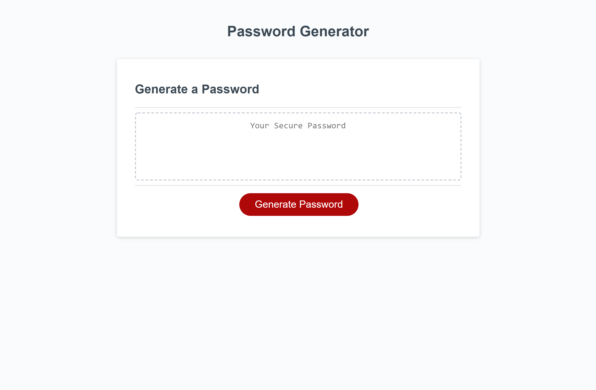

# Challenge 3 -- Password Generator

## Purpose
A website that can create a small, or large, random password for users' security purposes.

## Built with
* HTML
* CSS
* JavaScript

## Website
https://jmuel9999.github.io/challenge3-passwordgenerator/

## Screenshot

                                                    **NOTICE**               
I am aware of the current bug that will not allow the assignment to work 100% properly, I will be fixing that. The program can only pump out one, two, three, or four characters for a password at a time. This is dependent on how many of the prompts the user says "okay" to. Any constructive feedback is always welcome and appreciated!
